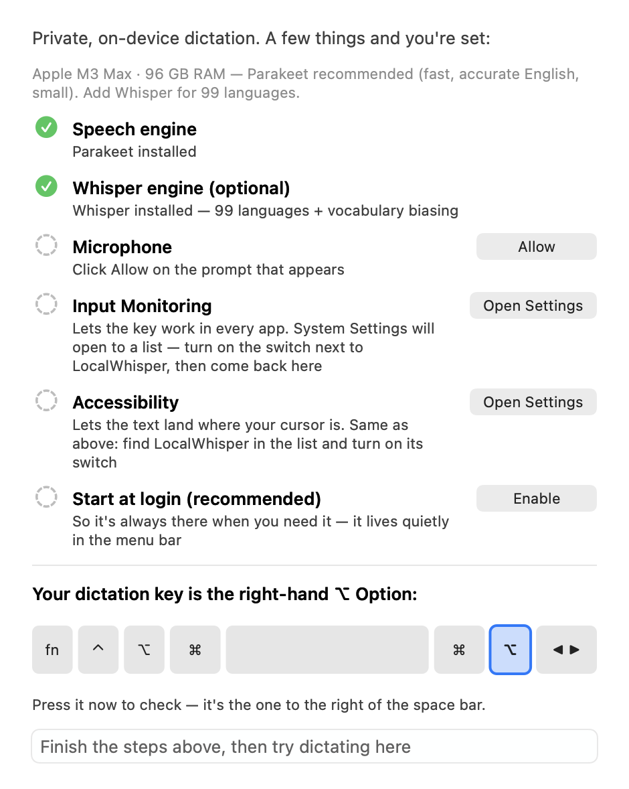
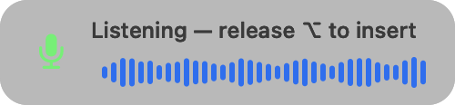

<!-- Public README. Lives in the private source repo at distribution/README.md
     and is copied to the public repo by scripts/publish-release.sh. Edit it there. -->
# LocalWhisper

**Push-to-talk dictation for macOS that never leaves your Mac.** Hold Right ⌥
(Option), speak, release — the transcript lands in whatever app has focus.

[](https://github.com/BillDX/LocalWhisper/releases/latest)


- **No network at runtime.** Speech is transcribed on-device by NVIDIA
  Parakeet TDT or OpenAI Whisper large-v3-turbo (via whisper.cpp),
  GPU-accelerated with Metal.
- **Audio never touches disk.** Samples live in memory and are gone when the
  text lands.
- **Nothing is logged.** No transcript history, no telemetry, no account.

## Download

**[Download the latest DMG →](https://github.com/BillDX/LocalWhisper/releases/latest)**
Open it, drag LocalWhisper to Applications, launch. The speech engine
(Parakeet, 669 MB) downloads on first launch, checksum-verified.

Requirements: Apple Silicon Mac, macOS 14 or later (built and tested on
macOS 26; 14 and 15 are untested). RAM while running: ~0.8 GB with Parakeet,
~1.7 GB with the optional Whisper engine.

### Install — the one-time Gatekeeper step

These builds are signed with a local certificate, not yet an Apple Developer
ID, so macOS will say it "could not verify" the app. Pick one:

**Terminal, no warnings.** Files fetched with `curl` aren't quarantined, so
Gatekeeper never gets involved:

```bash
curl -L -o ~/Downloads/LocalWhisper.dmg https://github.com/BillDX/LocalWhisper/releases/latest/download/LocalWhisper.dmg
```

**Browser download.** After dragging to Applications, either clear the
quarantine flag:

```bash
xattr -dr com.apple.quarantine /Applications/LocalWhisper.app
```

or open the app once, dismiss the warning, then System Settings → Privacy &
Security → scroll down to Security → **Open Anyway**.

Every release ships a `.sha256` next to the DMG if you want to verify the
download. Notarized builds are planned.

### First launch

A Setup Assistant walks you through it: the engine download, the three macOS
permissions (Microphone, Input Monitoring, Accessibility) with step-by-step
guidance, start-at-login, and a keyboard check that confirms you're pressing
the *right* Option key. The test field at the bottom unlocks when everything
is green.



## What it does

- **One gesture.** Hold Right ⌥ and talk; quick taps are ignored, so the key
  still works as a normal modifier. For long dictation, tap Right ⌘ while
  holding to **latch** hands-free; tap Right ⌥ to finish.
- **Two engines, auto-routed.** Parakeet (fast, best plain-English accuracy,
  European languages) and Whisper (99 languages, steerable by your
  vocabulary). *Auto* picks per utterance.
- **Accuracy stack.** Personal vocabulary list and presets, silence trim,
  voice-activity detection so long pauses can't derail a dictation, beam
  search, and deterministic substitution rules.
- **Nine HUD themes**, purely cosmetic: Modern, Green Phosphor, Red Eye,
  Starship, RetroComp '82, Oscilloscope, Punch Card, Groovy, and an 8-bit
  Happy Cloud that pours rainbows. Full gallery in the
  [User Guide](USER-GUIDE.md#the-menu-bar-icon).
- **Simple menu.** Everyday items up top, everything else under Advanced ▸.

| | | |
|---|---|---|
|  |  |  |

## Documentation

- [User Guide](USER-GUIDE.md) — every menu item, the privacy model,
  troubleshooting, updating
- [Tester notes](TESTERS.md) — what to try, how to report
- [Changelog](CHANGELOG.md)

## Privacy model

Audio is captured to memory, transcribed on this Mac, and discarded.
Transcripts are never written anywhere; the one exception you control is
*Copy Last Transcription*, held in memory until quit. The only network
operation the app ever performs is the model download you approve in setup.
What's on disk: the models, your vocabulary and substitution text files, and
your settings.

## Why this exists

LocalWhisper is a working demonstration of **sovereign, on-device AI**: a
complete speech product with no cloud dependency, provenance-verified models
(SHA-256 checked against the publishers' hashes), a codebase small enough to
audit in an afternoon, and no data exhaust. Built by
[Bill McIntyre](https://github.com/BillDX).

## Source code and license

The source is not published yet. It will be released under
**EUPL-1.2 OR GPL-3.0-or-later** — the EU's own open source license or the
GPL, at your option — and this repository will become its home, so the links
here won't change. Until then this is the download and documentation home.

The app is free to use for everyone, businesses included. See
[LICENSING.md](LICENSING.md) for the terms, commercial licensing
(`inquiries@atomo.com`), and the trademark policy;
[THIRD-PARTY-LICENSES.md](THIRD-PARTY-LICENSES.md) lists the components and
models it builds on.

## Feedback

[Open an issue](https://github.com/BillDX/LocalWhisper/issues). The app logs
nothing, so what you said vs. what appeared, plus your Mac model and macOS
version, is the whole bug report.
