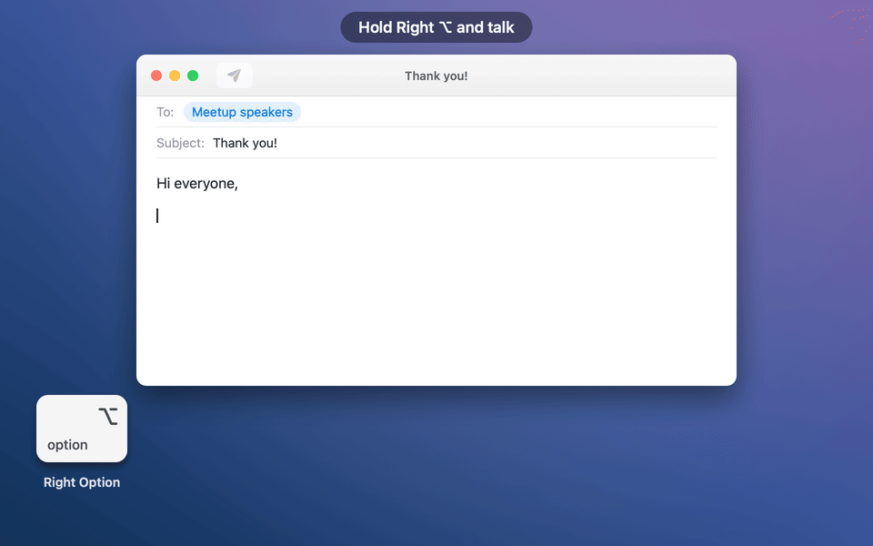

<!-- Public README. Lives in the private source repo at distribution/README.md
     and is copied to the public repo by scripts/publish-release.sh. Edit it there. -->
# Inside Voice

**Talk instead of type, on your Mac.** Hold one key, say what you mean, let
go: your words appear wherever you were typing. Email, documents, messages,
web pages, any app. Free, private, and nothing you say ever leaves your
computer.

[](https://github.com/BillDX/InsideVoice/releases/latest/download/InsideVoice.dmg)

For Macs with Apple Silicon (M1 or newer) on macOS 14 or later.
[How do I check?](#which-macs-does-it-work-on)

> **New to GitHub?** You're in the right place. GitHub is a website where
> software is built and shared, but you don't need an account or any
> technical know-how. The green button above downloads the app; that's all
> you need. You can ignore the file list and the **Code** button at the top
> of this page.



## Get started in three steps

**1. Download and install.** Click the green button above. Open the file
that downloads (`InsideVoice.dmg`, in your Downloads folder) and drag the
Inside Voice icon onto the Applications folder next to it.

**2. Open it and follow the setup.** Open Inside Voice from your
Applications folder. It's signed and checked by Apple, so it opens like any
other app. A setup window walks you through the rest: a one-time download of
the speech engine (669 MB, a few minutes on home Wi-Fi), then three
permissions that macOS asks you to approve. Each one has a button and a
plain explanation. [What are the permissions for?](#why-does-it-ask-for-three-permissions)


**3. Hold the right Option key and talk.** Click wherever you want to type,
hold down the **Option ⌥ key to the right of the space bar**, speak, and
let go. Your words appear a moment later.

Inside Voice has no window or Dock icon after setup. It lives in the menu
bar at the top right of your screen, as a small waveform circle. Click it
for settings.


**Saying a lot?** While holding the right Option key, tap the right
**Command ⌘** key next to it, then let go of both. It keeps listening
hands-free, with a lock on screen so you know. Tap the right Option key
once when you're done.


## Private by design

- **Nothing leaves your Mac.** The speech engine runs on your computer. It
  works exactly the same with the Wi-Fi off.
- **Nothing is saved.** Your voice is never recorded to a file, and nothing
  you say is logged or kept.
- **No account, no subscription, no ads.** Free for everyone, including at
  work.

## Questions

### Which Macs does it work on?

Macs with Apple Silicon (M1, M2, M3, M4, or newer) on macOS 14 Sonoma or
later. To check: click the Apple menu at the top left of your screen,
then **About This Mac**. If the "Chip" line says **Apple M**-something,
you're set. If it says "Processor … Intel", Inside Voice won't run on that
Mac, sorry.

### Why does it ask for three permissions?

These sound alarming, but they're the same ones any dictation or
keyboard-shortcut app needs, and Inside Voice never sends anything over the
internet:

- **Microphone**, to hear you while you hold the key.
- **Input Monitoring**, to notice when you hold the right Option key, even
  while you're working in another app.
- **Accessibility**, to type your words into the app you're using.

The setup window opens the right page of System Settings for each one; you
turn on the switch next to Inside Voice and come back.

### Is it really free?

Yes, for everyone, including at work and on as many Macs as you like. No
trial, no account, no ads. It's a personal project by
[Bill McIntyre](https://github.com/BillDX), built to show that useful AI can
run entirely on your own computer.

### Is it safe to install?

The app is signed by its developer and checked by Apple for malicious
software (Apple calls this notarization) before every release. That's why it
opens without warnings.

### Does it work in Word / Gmail / Slack / …?

Anywhere you can click and type: mail, documents, chat apps, web browsers,
notes. If text ever lands in the wrong place, click into the right spot and
use **Copy Last Transcription** from the menu bar icon.

### What languages does it understand?

English and 24 other European languages out of the box. An optional second
engine, offered in the setup window, adds 99 languages including Japanese,
Chinese, Korean, and Hindi.

### Do I need the internet?

Only once, to download the speech engine during setup. After that it never
uses the internet.

### How do I update it?

Click the green button again and drag the new app onto the old one in
Applications (choose **Replace**). Your settings carry over.

### How do I remove it?

Drag Inside Voice from Applications to the Trash. To also remove the
downloaded speech engine (to free up space), open Finder, choose **Go → Go
to Folder…**, paste `~/Library/Application Support/Inside Voice`, and
delete that folder.

### Something isn't working

The [User Guide](USER-GUIDE.md#troubleshooting) has a troubleshooting
section in plain language. To ask a question or report a problem,
[open an issue](https://github.com/BillDX/InsideVoice/issues) (it needs a
free GitHub account). Since the app keeps no record of what you said, it
helps to include what you said, what appeared instead, your Mac model, and
your macOS version.

## More to explore

- **Your own words.** Add names, jargon, and product names to a personal
  word list so they come out right.
- **Eight display themes**, purely for fun: Modern, Green Phosphor, Red Eye,
  RetroComp '82, Oscilloscope, Groovy, Glitter Text, and Top Secret.
- **Two speech engines**, picked automatically for each thing you say.

Everything is explained in the [User Guide](USER-GUIDE.md).

| | | |
|---|---|---|
|  |  |  |

---

## For the technically curious

[](https://github.com/BillDX/InsideVoice/releases/latest)


**Under the hood.** Speech is transcribed on-device by NVIDIA Parakeet TDT
or OpenAI Whisper large-v3-turbo (via whisper.cpp), GPU-accelerated with
Metal. *Auto* picks per utterance: Parakeet for speed and plain-English
accuracy, Whisper when your vocabulary list is active or the language needs
it. Silence trim, voice-activity detection (so long pauses can't derail a
dictation), beam search, and deterministic substitution rules. Quick taps
of Right ⌥ are ignored, so the key still works as a normal modifier.

**Homebrew.** Version 7 and later ask you to trust third-party taps first:

```bash
brew trust BillDX/tap
brew tap BillDX/tap
brew install --cask inside-voice
```

If `brew trust` says "unknown command", your Homebrew is older than 7: skip
that line. Later updates: `brew upgrade --cask inside-voice`.

**Older releases** and release notes live on the
[Releases page](https://github.com/BillDX/InsideVoice/releases).

**Slow or blocked Wi-Fi?** The DMG is 4 MB; the speech engine is a separate
669 MB download in the Setup Assistant. If someone hands you the model file
instead (`ggml-parakeet-tdt-0.6b-v3-q8_0.bin`, from
[ggml-org/parakeet-GGUF](https://huggingface.co/ggml-org/parakeet-GGUF)),
drop it in `~/Library/Application Support/Inside Voice/models/` before
launching and the Setup Assistant will see it as installed.

**Upgrading from 1.3.0 or earlier?** 1.4.0 is the first notarized build, so
its signing identity changed: macOS asks for the three permissions again and
Launch at Login needs re-enabling. The Setup Assistant opens to handle it.
Coming from LocalWhisper, your models, word lists, and settings move over
automatically; delete the old LocalWhisper.app afterwards.

**Requirements in detail:** Apple Silicon Mac, macOS 14 or later (built and
tested on macOS 26; 14 and 15 are untested). RAM while running: ~0.8 GB with
Parakeet, ~1.7 GB with the optional Whisper engine.

**Verify the download.** Builds are signed with a Developer ID and notarized
by Apple. Every release also ships a `.sha256` next to the DMG:

```bash
curl -L -O https://github.com/BillDX/InsideVoice/releases/latest/download/InsideVoice.dmg.sha256
shasum -a 256 -c InsideVoice.dmg.sha256
```

**Uninstall with Homebrew:** `brew uninstall --zap --cask inside-voice`
removes the app and `~/Library/Application Support/Inside Voice` (models and
word lists).

### Privacy model

Audio is captured to memory, transcribed on this Mac, and discarded.
Transcripts are never written anywhere; the one exception you control is
*Copy Last Transcription*, held in memory until quit. The only network
operation the app ever performs is the model download you approve in setup.
What's on disk: the models, your vocabulary and substitution text files, and
your settings.

### Documentation

- [User Guide](USER-GUIDE.md) — every menu item, the privacy model,
  troubleshooting, updating
- [Tester notes](TESTERS.md) — what to try, how to report
- [Changelog](CHANGELOG.md)

## For teams

Inside Voice is free to use at work, on as many Macs as you like. If your
team needs more than a download, that is what I do:

- **Rollout help** for managed Macs: packaging, the three permission
  prompts, and what your MDM can and cannot pre-approve.
- **Your vocabulary, built in.** Word lists and substitution rules for your
  product names, people, and jargon, so transcripts come out right the first
  time.
- **A support agreement.** A named contact, response times, and fixes when a
  macOS update moves something.
- **Security review support.** The privacy model in writing, answers to your
  vendor questionnaire, and a codebase small enough for your own team to
  audit.
- **A commercial license** where copyleft does not fit: embedding the engine
  in your own product, or a policy that excludes GPL software.

On the roadmap, and shaped by whoever asks first: settings locked by policy,
themes off by default, an audit trail, and a compliance pack.

Write to <inquiries@atomo.com>, or open an issue titled "For teams".

## Why this exists

Inside Voice is a working demonstration of **sovereign, on-device AI**: a
complete speech product with no cloud dependency, provenance-verified models
(SHA-256 checked against the publishers' hashes), a codebase small enough to
audit in an afternoon, and no data exhaust. Built by
[Bill McIntyre](https://github.com/BillDX).

## Source code and license

The source is not published yet. It will be released under
**EUPL-1.2 OR GPL-3.0-or-later** — the EU's own open source license or the
GPL, at your option — and this repository will become its home, so the links
here won't change. Until then this is the download and documentation home.

The app is free to use for everyone, businesses included. See
[LICENSING.md](LICENSING.md) for the terms (including attribution),
commercial licensing (`inquiries@atomo.com`), and the trademark policy;
[THIRD-PARTY-LICENSES.md](THIRD-PARTY-LICENSES.md) lists the components and
models it builds on.
