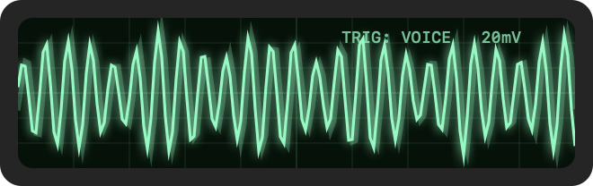
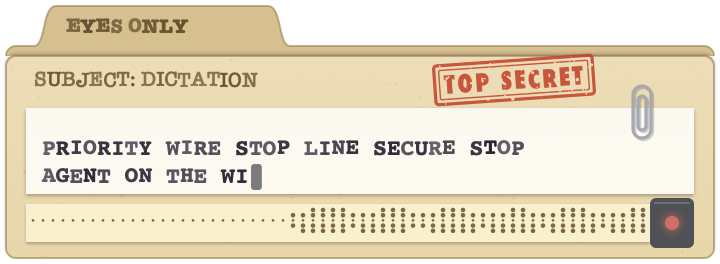

# Inside Voice User Guide

## Core Function: 

**Hold Right ⌥ (Option), speak, release.**  The transcript appears wherever
your cursor is — any app, any text field. That's the whole product; the rest
of this guide is refinement.

While you hold the key, a small floating panel shows a live level meter
("Release ⌥ to insert · ⌘ to lock"), then a spinner ("Transcribing…"), then
disappears as the text lands. On an M-series Mac the wait after release is
under a second for typical utterances.

| To… | Do this |
|---|---|
| Dictate a sentence or two | **Hold Right ⌥**, speak, release |
| Dictate hands-free, as long as you like | Hold Right ⌥, **tap Right ⌘**, let go of both. Tap Right ⌥ to finish |


### Hands-free: lock it on

For anything longer than a breath, lock the recording (the "latch"): while
holding Right ⌥, tap **Right ⌘**, the key right next to it. The recording
locks on and you can let go of everything. Speak as long as you like, pauses
included; the HUD stays on screen with a lock indicator the whole time, so
you always know the mic is live. Tap Right ⌥ once to finish and insert.

The lock starts from a held key, so it never looks like a double-tap to
other apps' hotkey gestures. The reminders are in the app too: the menu's
second line, the Setup Assistant's keyboard diagram, and the listening HUD
("⌘ to lock") in the Modern, Glitter Text, and Top Secret themes.

Some details you'll discover anyway, made explicit:

- A **quick tap does nothing** — presses shorter than about a third of a
  second are ignored, so using Right ⌥ as a normal modifier key stays safe.
  The key still works as Option for other apps even while Inside Voice
  watches it.
- **Silence is trimmed** from both ends of your recording, and an all-silent
  clip is discarded without transcribing. Long pauses *inside* a dictation
  are fine too — a voice-activity model finds the speech and whisper
  transcribes only that, so you can stop and think mid-thought for minutes
  without derailing the transcript.
- If you held the key but no words came through, a small **"Didn't catch
  that"** notice appears — so you know it heard nothing rather than
  wondering whether it failed silently.
- Punctuation is **inferred from your speech**, not spoken commands — say the
  sentence naturally and whisper punctuates it. (Spoken "new line" /
  "scratch that" commands are on the roadmap, not in the app yet.)

## Installing

**Download** the DMG from the
[Releases page](https://github.com/BillDX/InsideVoice/releases/latest), open
it, drag Inside Voice to Applications, and launch. Builds are signed with a
Developer ID and notarized by Apple, so there is no Gatekeeper warning.

**Or with Homebrew** (version 7 and later ask you to trust third-party taps
first):

```bash
brew trust BillDX/tap && brew tap BillDX/tap && brew install --cask inside-voice
```

If `brew trust` says "unknown command", your Homebrew is older than 7: skip
that line.

**First launch** opens the Setup Assistant: download the speech engine
(Parakeet, 669 MB, checksum-verified; Whisper is an optional second
download), grant Microphone, Input Monitoring, and Accessibility with
step-by-step guidance, switch on Start at login, and confirm on the keyboard
diagram that you are pressing the *right* Option key. The test field at the
bottom unlocks when everything is green.

**Requirements:** an Apple Silicon Mac on macOS 14 or later (built and
tested on macOS 26). No internet after setup.

**No good Wi-Fi for the 669 MB engine download?** If you have the model file
from elsewhere (`ggml-parakeet-tdt-0.6b-v3-q8_0.bin`, published at
[ggml-org/parakeet-GGUF](https://huggingface.co/ggml-org/parakeet-GGUF)), put
it in `~/Library/Application Support/Inside Voice/models/` before launching;
the Setup Assistant treats it as installed.

**Uninstall:** drag the app to the Trash and delete
`~/Library/Application Support/Inside Voice`, which holds the models and your
word lists — or `brew uninstall --zap --cask inside-voice`.

## The menu bar icon

The waveform circle in your menu bar is the whole interface. Its shape
reflects state: hourglass while the model loads (a few seconds after
launch), filled dot while recording, ellipsis while transcribing,
exclamation mark if something's wrong.

The menu keeps the everyday things up top — Copy Last Transcription,
Theme, Setup Assistant, Launch at Login — and tucks everything else under
**Advanced ▸**. You can ignore Advanced entirely; the defaults are tuned
to just work. The sections below cover all of it anyway.

**Copy Last Transcription** — your most recent transcript, kept only in
memory. Use it when you dictated into the wrong window. Quitting the app
forgets it.

**Insert Text By** — three delivery methods:

| Mode | How it works | Choose it when |
|---|---|---|
| **Paste** (default) | Copies to clipboard, sends ⌘V, restores your old clipboard ~½ s later | Almost always — fastest and most reliable |
| **Type it out** | Synthesizes real keystrokes | Apps that block pasting or handle keys specially (some terminals, remote desktops, password-adjacent fields) |
| **Clipboard only** | Just puts the text on the clipboard | You want to review before pasting, or the target is on another machine |

**Language** — Auto-detect works well; pinning your language shaves a little
latency and removes occasional wrong-language guesses. Non-English dictation
is fully supported (whisper covers ~99 languages).

**Engine** — which speech model listens to you:

- **Whisper** — ~99 languages, and the only engine the Vocabulary
  prompt can steer, which makes it the accuracy pick for jargon-heavy
  dictation.
- **Parakeet** — the accuracy pick for *plain* English (it beats whisper on
  standard English benchmarks), several times faster, and immune to
  whisper's invent-text-on-silence quirk. European languages only. A
  separate 669 MB download (Setup Assistant → "Parakeet engine");
  substitution rules still apply, so your forced spellings survive.
- **Auto** (default) — quality-first routing: Whisper whenever your vocabulary is
  active (its jargon edge) or the language needs it (Japanese, Chinese,
  Korean, Hindi); Parakeet for vocabulary-off plain English, where it's
  the stronger model. The menu status line shows which engine Auto is
  currently using and why.

The Setup Assistant reads your Mac's chip and RAM and shows it on the
first line. Parakeet is the recommended first engine everywhere (faster,
more accurate on plain English, a third of the download); Whisper is the
optional add-on for other languages and vocabulary biasing, and on 8 GB
Macs the assistant notes that its ~1.7 GB resident footprint is a squeeze.

**Vocabulary** — how you teach it your world:

- **Personal List** is a plain text file (one term per line). *Edit Personal
  List…* opens it in your editor; changes apply to your very next utterance,
  no restart. Put project names, coworkers, brand spellings, and acronyms
  here — anything it keeps mangling.
- **Coder** is a built-in preset (~80 dev/web/macOS/AI terms), off by
  default — turn it on if you dictate a lot of developer jargon.

The vocabulary *biases* recognition rather than forcing it — it fixes most
spellings and casings ("SwiftPM", "ggml"), but isn't a guarantee. For the
stubborn cases there's **Edit Substitution Rules…**: deterministic
find→replace applied to every transcript. One rule per line
(`questline -> Questline`, `eye oh ess -> iOS`); matching is
case-insensitive and whole-word, multi-word phrases welcome, and the
replacement is inserted exactly as written. Rules apply from your very
next utterance.

**Higher Accuracy (Whisper Beam Search)** — on by default; Whisper only
(Parakeet's greedy decode is already its benchmark mode, and it has no beam
option). On Apple Silicon the speed cost is essentially zero, so leave it
on; the toggle exists for older or busy machines.

**Theme** — how the dictation HUD looks and talks. Purely cosmetic,
switchable anytime, applies to your next utterance. Eight to choose from:

| Theme | |
|---|---|
| **Modern** (default) — native translucent panel, green mic, accent-colored meter |  |
| **Green Phosphor** — glowing CRT terminal, scanlines, blinking cursor |  |
| **Red Eye** — a red lens that swells as you speak and addresses you by name; unhurried breathing while it thinks |  |
| **RetroComp '82** — royal blue 8-bit screen, chunky pixel meter, raster-bar loading border |  |
| **Oscilloscope** — graticule screen, glowing trace riding your voice; Lissajous figure while analyzing |  |
| **Groovy** — 1968 flower power: doors swing open with flowers springing out, a daisy meter, go-go headlines |  |
| **Glitter Text** — Y2K glitter graphics: bubbly sticker-edged letters filled with shimmering pink, gold, and lilac, sparkles twinkling inside them and drifting across a pastel sky. A different headline each time (SPARKLE ON, SO SHINY, USE YOUR INSIDE VOICE), a glitter bar that gets denser the louder you are, chasing sparkles while loading, and a glitter-bomb burst of hearts and stars when your text lands |  |
| **Top Secret** — a 1960s secret-agent case file: manila folder stamped TOP SECRET, a teletype hailing a new silly codename every time you dictate (COME IN SOGGY WAFFLE STOP), and five-hole paper tape punched in time with your voice. It hammers out cipher groups while decoding, and a CASE CLOSED stamp slams down when your text lands (DELIVERED STOP SHRED AFTER READING STOP) |  |

**Play Sound on Insert** — a soft pop when text lands. Off by default.

**Permissions** — live ✓/✗ for the three macOS grants; click any row to open
the right System Settings pane. Sits at the top level only while something
needs doing; once all three are granted it tucks into Advanced.

**Setup Assistant…** — reopens the first-run window (engine downloads, the
permission grants with step-by-step guidance, start-at-login, a keyboard
check that confirms you're pressing the *right* Option key, and a test
field). Harmless to open anytime.


**Launch at Login** — what it says.

**About Inside Voice** — the version, the copyright, the license, and links
to the license texts that ship inside the app.

## Privacy model, in plain language

- Audio is captured to memory, transcribed on this Mac, and gone. It never
  touches disk and never leaves the machine. There is no network use at
  runtime at all — the only network operation the app ever performs is the
  one-time model download you approve in setup.
- Transcripts are never written anywhere by the app. The single exception
  you control: the last transcript is held in memory for the *Copy Last
  Transcription* menu item, and vanishes on quit.
- What *is* stored on disk: the speech model(s) you downloaded, your
  vocabulary and substitution text files, and your settings
  (`~/Library/Application Support/Inside Voice/`, plus standard macOS
  preferences). No audio, no history, no logs.

## Troubleshooting

**Hotkey only works when Inside Voice is frontmost** — the classic. Input
Monitoring isn't granted: menu → Permissions — action needed → Input
Monitoring (or Setup Assistant…). The app picks the grant up within a few
seconds; no relaunch needed.

**HUD appears and transcribes, but no text lands** — Accessibility isn't
granted (needed to deliver the text). Same drill: Permissions or the Setup
Assistant.

**HUD never appears at all** — check Microphone in the Setup Assistant, and
confirm the engine finished loading (the menu's first line reads
"Engine: …" rather than "Loading speech engine…").

**Text lands in the wrong place** — the text goes to whatever owns keyboard
focus at the moment you release. Click into the target field first, then
dictate. If it already happened: *Copy Last Transcription*.

**It typed over my clipboard** — paste mode restores your clipboard about
half a second after inserting. If you copy something new *within* that
window it can be clobbered — rare in practice; use Clipboard-only mode if it
bites you.

**A word keeps coming out wrong** — add it to Advanced → Vocabulary → Edit
Personal List…, dictate again, and it should improve immediately (that
prompt only steers Whisper; with Auto, an active list routes you to Whisper
automatically). If it *still* comes out wrong, make it a substitution rule
(Vocabulary → Edit Substitution Rules…) — those apply to both engines,
unconditionally.

**"No speech engine downloaded" / load errors** — menu → Setup Assistant…
and use the Download button (progress bar, checksum-verified, pausable).

**It took a while after I let go** — a long dictation on Whisper decodes at
roughly 30× realtime; Parakeet is several times faster. Advanced → Engine →
Parakeet (or Auto with vocabulary off) if speed matters more than jargon.

## Updating

Updates arrive as a new DMG on the
[Releases page](https://github.com/BillDX/InsideVoice/releases): open it,
drag Inside Voice to Applications, click Replace. Homebrew users:
`brew upgrade --cask inside-voice`. Everything important survives the swap —

- your three permission grants (they are tied to the app's signing
  identity, not the individual build),
- the downloaded models, your vocabulary and substitution lists, and all
  settings (they live in `~/Library/Application Support/Inside Voice/`,
  outside the app).

Quit the running copy first (menu → Quit Inside Voice), replace, relaunch.
If it was set to launch at login, that carries over too.

**Two updates that reset the permissions once.** 1.3.0 renamed the app from
LocalWhisper (new bundle identifier), and 1.4.0 is the first notarized build
(new signing identity). After either, macOS asks for Microphone, Input
Monitoring, and Accessibility again and Launch at Login needs one click; the
Setup Assistant opens on its own to walk you through it. Your models, word
lists, and settings are kept — the rename moves them to the new location on
first launch. Delete the old LocalWhisper.app if it is still around.

In-app automatic updates ("a new version is available…") are on the
roadmap.

## Requirements, briefly

Apple Silicon Mac. RAM while running: ~0.8 GB with Parakeet, ~1.7 GB with
Whisper. Disk: 669 MB (Parakeet) and/or 1.6 GB (Whisper). No internet
needed after setup.
